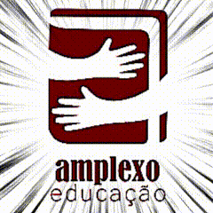

  <!-- Imagem Principal / Animação Amplexo -->
  

   

  <!-- Título Principal com Efeito Dinâmico -->
  

  

    <strong>💡 Transformando curiosidade em aprendizado, aprendizado em soluções e soluções em conquistas.🏆</strong>
  

  <!-- Badges de Status / Redes -->
  

    
    
    
  

---

### 👨‍🏫 Quem é o Tio Vené?

> *"Ensinar sobre tecnologia não é apenas mostrar comandos em uma tela; é ensinar a pensar, resolver problemas reais e ter autonomia para criar o futuro."*

Olá! Meu nome é **Venelouis**, mas também sou conhecido como: **Tio Vené**. Apaixonado por educação tecnológica, pensamento computacional e formação de novas gerações de talentos. Trabalho ativamente no **Clube Amplexo Educação**, onde combinamos metodologia, paixão e tecnologia para inspirar estudantes.

---

### 🚀 O Que Eu Faço & Minhas Frentes de Atuação

<table>
  <tr>
    <td width="33%" align="center" valign="top">
       
      
        
      <h4><b>Treinamento Olímpico</b></h4>
      

        Preparação intensiva para competições e olimpíadas de conhecimento e informática (ex: <b>OBI</b>). Foco em raciocínio lógico rápido, algoritmos, estruturas de dados e estratégias de prova.
      

    </td>
    <td width="33%" align="center" valign="top">
       
      
        
      <h4><b>Aulas Personalizadas</b></h4>
      

        Acompanhamento 1-on-1 sob medida. Do primeiro <i>Hello World</i> à criação de projetos e programas práticos, respeitando o ritmo e despertando o interesse genuíno de cada aluno.
      

    </td>
    <td width="33%" align="center" valign="top">
       
      
        
      <h4><b>Clube Amplexo Educação</b></h4>
      

        Desenvolvimento de atividades, projetos e experiências educacionais enriquecedoras, promovendo tecnologia, criatividade e colaboração entre estudantes.
      

    </td>
  </tr>
</table>

---

### 🛠️ Algumas Tecnologias de Ensino

  <!-- Linguagens & Algoritmos -->
  
  
  
  
  
  
   

  <!-- Ferramentas e Didática -->
  
  
  
  
  

---

### 📊 Estatísticas no GitHub

  
  &nbsp;
  

  

---

### 💬 Vamos Conversar?

Seja para agendar aulas particulares, mentoria para olimpíadas, trocar experiências sobre educação ou conhecer os projetos do **Clube Amplexo**, sinta-se à vontade para me mandar uma mensagem!

  
  &nbsp;
  

 

  Com amor <b>Tio Vené</b> 🚀

